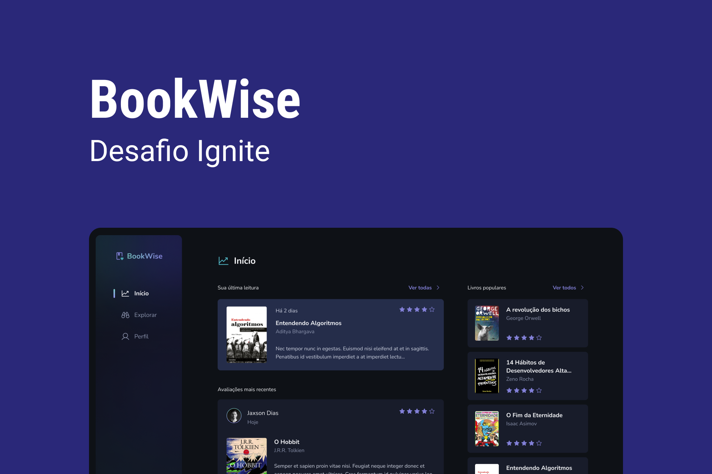

# BookWise


O BookWise é uma plataforma desenvolvida com [Next.js](https://nextjs.org) para avaliações de livros onde os leitores podem avaliar os mais diversos livros. Uma vez que a aplicação realiza autenticação por meio do padrão OAuth, é possível realizar login por meio de sua conta do Google ou GitHub.

Por se tratar de uma aplicação full-stack, foi desenvolvido um back-end por meio das API routes do [Next.js](https://nextjs.org) com uso do ORM [Prisma](https://prisma.io/) para auxiliar na comunicação com o banco de dados [SQLite](https://sqlite.org/).

Durante o desenvolvimento da aplicação foram adicionadas algumas funcionalidades para auxiliar na experiência de uso, como `debounce` para otimização das buscas. Também foi implementada a persistência dos filtros de buscas na rota da aplicação, de modo que o usuário consiga compartilhar sua pesquisa com outros. Sendo assim, até mesmo `Dialogs` permanecem abertas ao realizar o refresh da aplicação ou ao compartilhar sua URL. 



## Getting started

Inicie instalando as dependências do projeto: 

```shell
pnpm i
```

Para executar o projeto, é necessário configurar corretamente as variáveis de ambiente como exemplificado no [arquivo .env.example](./.env.example). Abaixo são descritos o uso de cada variável.

O projeto utiliza o ORM [Prisma](https://prisma.io/) e para isso é necessário estabelecer a conexão com o banco e executar as migrations:

```env
DATABASE_URL="file:./prisma/dev.db"
```

```shell
npx prisma migrate dev
```

Para implementar a funcionalidade de agendamento, foram utilizados os serviços da [Google Cloud](https://cloud.google.com/). Para isso é necessário a configurar a permissão OAuth para obter as credenciais de ID do cliente para Aplicativo da Web. As credenciais criadas serão um `ID do cliente` e uma `Chave secreta do cliente` que devem ser utilizadas nas seguintes variáveis de ambiente:

```env
GOOGLE_CLIENT_ID="1234-exampleclientid.apps.googleusercontent.com"
GOOGLE_CLIENT_SECRET="EXAMPLE-Secret_Key1234"
```

Também será necessário configurar um OAuth App nas configurações de desenvolvedor do GitHub. Após criar a aplicação OAuth, será possível obter a `ID do cliente` e gerar uma `Chave secreta do cliente` que devem ser utilizadas nas seguintes variáveis de ambiente:

```env
GITHUB_CLIENT_ID="yourGithubClientId"
GITHUB_CLIENT_SECRET="yourGithubClientSecret"
```

Para realizar a autenticação com o [NextAuth.js](https://next-auth.js.org/), é necessário definir um `secret`. Esse valor poder ser gerado por meio do comando abaixo como sugerido pela [documentação](https://next-auth.js.org/configuration/options#secret):

```shell
openssl rand -base64 32
```

Por fim, execute o projeto em ambiente de desenvolvimento: 

```shell
pnpm i
```

## Tecnologias

- [Axios](https://axios-http.com)
- [date-fns](https://date-fns.org/)
- [ESLint](https://eslint.org/)
- [Next.js](https://nextjs.org/)
- [NextAuth.js](https://next-auth.js.org/)
- [Nookies](https://github.com/maticzav/nookies#readme)
- [Prisma](https://prisma.io/)
- [React Hook Form](https://react-hook-form.com/)
- [ReactJS](https://reactjs.org/)
- [SQLite](https://sqlite.org/)
- [Stitches](https://stitches.dev/)
- [TanStack Query](https://tanstack.com/query)
- [Typescript](https://typescriptlang.org/)
- [Zod](https://zod.dev/)

## Licença

Este projeto está licenciado sob o MIT. Consulte a [licença](LICENSE) para mais informações.